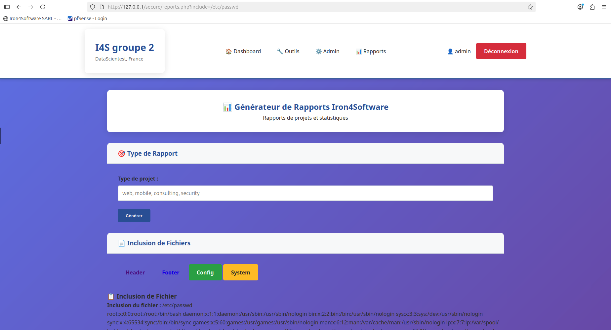

# Iron4Software - Application Vulnérable

Application web de la société Iron4Software SARL  avec vulnérabilités intentionnelles pour tests de pénétration.

## Pentesters
- Ludo
- Damien  
- Emilio

## Installation

- git clone https://github.com/Lud-ly/iron4software.git
- cd iron4software
- sudo cp -r . /var/www/html/iron4software/
- sudo chown -R www-data:www-data /var/www/html/iron4software/
- sudo mkdir -p /var/www/html/iron4software/{uploads,logs}
- sudo chmod 777 /var/www/html/iron4software/{uploads,logs}
- mysql -u root -p < setup.sql
- sudo systemctl restart apache2

## Accès
- URL: http://127.0.0.1
- Comptes: admin/admin123, jdupont/password, mmartin/test123, sgarcia/iron4


## ⚠️ après deploy
- chmod 755 /var/www/html/iron4software/logs
- sudo mkdir -p /var/www/html/uploads
- sudo chown www-data:www-data /var/www/html/uploads
- sudo chmod 755 /var/www/html/uploads

# Site web Iron4software





## FAILLES

## 1. Fichier reports.php — inclusion de fichier et formulaire de rapport
   
   a) Vulnérabilité LFI (Local File Inclusion) - Inclusion non filtrée

``` php
   if (isset($_GET['include'])) {
    $file = $_GET['include'];
    echo "<p><strong>Inclusion du fichier :</strong> " . htmlspecialchars($file) . "</p>";
    echo "<div class='include-output'>";
    include $file; // << Inclusion directe sans validation
    echo "</div>";
    }
```

Il est possible de passer n'importe quel chemin dans ?include=, par exemple /etc/passwd ou tout fichier accessible par PHP même à l’extérieur du projet. Il est aussi possible de jouer avec les filtres PHP 


b) Injection SQL possible via generateReport($type)

``` php
    if ($_GET && isset($_GET['type'])) {
    $type = $_GET['type'];
    $reportData = generateReport($type);
    }
```
Si generateReport ne prépare pas ses requêtes (et utilise directement $type interpolé dans SQL), il y aura une injection SQL possible via le paramètre type.


## 2. Fichier admin.php — Recherche employés
   
   a) Injection SQL classique dans le paramètre search

```php

   if ($_GET && isset($_GET['search'])) {
    $search = $_GET['search'];
    $sql = "SELECT * FROM employees WHERE username LIKE '%$search%' OR department LIKE '%$search%'";
    $searchResults = $db->query($sql);
    }
```

Injection directe du paramètre utilisateur $search dans la requête sans préparation ni échappement.
Un attaquant peut provoquer une injection SQL via la variable search. Fuite de données, modification ou suppression de données, voire prise de contrôle via injection.

b) Affichage non sécurisé de la recherche

Affichage protégé par htmlspecialchars(), aucune faille XSS dans ce code.

## 3. Fichier tools.php — Affichages et requêtes

Permet exploitation d’une CVE connue via simple upload.

Aucune validation côté serveur → tous les classiques des failles upload sont présents.

   


   ## File upload non sécurisé
    Le script d’upload (tools.php) accepte tout type de fichier, sans filtrage ni restriction, permettant :

        Téléversement de fichiers malveillants ou de scripts PHP.

        Éventuelle exécution de code arbitraire (webshell, backdoor).

        Exploitation de failles GD/imageloadfont (ex: CVE-2022-31630) via fichiers .gdf craftés.

        Path traversal possible : le nom de fichier n’est pas nettoyé.

   ## Stockage des mots de passe en clair (setup.sql, database.php) :

    Les mots de passe utilisateurs ne sont pas hashés ni chiffrés, stockés tels quels dans la base.

    Si la base/le code est compromis, extraction immédiate possible.


   ## Configuration PHP vulnérable
    Permissions laxistes sur les dossiers uploads/logs, affichage des erreurs, etc. Peut être exploité.

   
   ## Injection SQL (secure/admin.php, potentiellement secure/reports.php):

    Les entrées utilisateurs sont injectées sans requêtes préparées.

    Un attaquant peut lire, modifier ou supprimer des données via des payloads SQLi (ex : ' OR 1=1 --).

    MySQL 8 n’atténue pas ces injections sur du SQL concaténé (pas d’escape auto).


   ## Local File Inclusion (LFI) (secure/reports.php):

    N’importe quel fichier du serveur peut être inclus et lu via le paramètre include.

    Exploitable pour lire des fichiers sensibles autant système que projet (ex : /etc/passwd, config/database.php).

    Possibilité de wrapper PHP (ex : php://filter/convert.base64-encode/resource=...) pour extraire le code source PHP.

   ## Pas de limitations sur la taille du fichier uploadé
    Permet des attaques par saturation du disque (DoS).

   ## Gestion incomplète des erreurs
    Peu de gestion d’erreurs côté upload et base.
